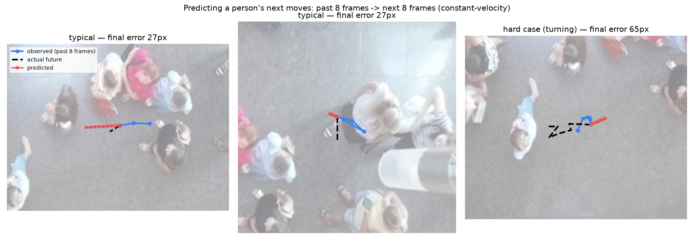

# cooking-robot-safety — 사람 궤적 예측 & 선제 정지

조리 로봇 셀을 천장 카메라로 감시해, **사람이 다음에 어디로 갈지 예측**하고 위험하면 로봇을 **미리 감속·정지**시킨다. 이 레포는 그중 **궤적 예측 + 안전 판정(SSM)** 부분이다.

> 사람 검출 모델(YOLO11s)은 별도 레포: [chanubc/overhead-person-yolo11](https://github.com/chanubc/overhead-person-yolo11)

## 왜 예측이 필요한가

로봇 주변에 원을 그려놓고 "들어오면 정지"하면 두 가지가 안 된다.
- 이미 들어온 뒤에 멈춰서 **늦다**.
- 옆으로 **지나갈 뿐인 사람**에게도 멈춰서 생산성을 깎는다.

사람의 **속도와 방향**을 알면 "3초 뒤 위험구역에 들어오겠다"를 미리 알 수 있다. 그래서 **선제 정지(안전)** 와 **불필요한 정지 안 함(생산성)** 을 동시에 얻는다.

## 입력과 출력

```
천장 카메라 → YOLO 검출 → 추적(ID 부여) → [이 레포] 궤적 예측 → SSM 판정 → 로봇 제어
```

**입력**: 사람별 최근 위치 시계열 `(시각, x, z)` — 이미지가 아니라 좌표 숫자
**출력**: 미래 위치 `(시각, x, z, 불확실성)` → 최종 판정 **`run / slow / stop`**

실행 예시 (`python -m trajectory.example`): 사람이 로봇 쪽으로 접근하는 상황

```
입력   history: (2.4, 2.4, 0) (2.6, 2.0, 0) (2.8, 1.6, 0) (3.0, 1.2, 0)   # x가 2.4→1.2로 접근
출력   t=3.4  x=+0.44  sigma=0.14   ← 0.4초 뒤 위험구역 진입 예측
       t=5.0  x=-2.68  sigma=0.59   ← 멀수록 불확실성 증가
판정   "stop"
```

---

## 궤적 데이터를 어디서 얻었나

검출용으로 쓴 [오버헤드 데이터셋](https://universe.roboflow.com/riccardo-kxtut/overhead-person-szky0/dataset/3)은 사실 **24개의 연속 영상**(프레임 0,1,2,…)이다. 그래서 프레임마다 있는 정답 박스를 **겹침(IoU)으로 이어 붙이면 같은 사람에게 ID가 붙고, 그 사람의 (x,y) 이동 경로**가 나온다. 검출용 데이터가 그대로 **궤적 데이터**가 되는 것.


왼쪽 두 장은 8프레임 차이 — `id 2`, `id 11`, `id 16`이 그대로 유지된다. 오른쪽이 그렇게 만들어진 궤적. 이렇게 **23클립 · 429개 궤적 · 33,633개 학습/평가 구간**을 얻었다.

## 예측이란 무엇인가

과거 8프레임을 보고 다음 8프레임의 위치를 맞히는 것.



파랑=관찰한 과거, 검정 점선=실제 미래, 빨강=예측. 직진하면 잘 맞고(27px), **방향을 틀면 빗나간다**(65px). 이 "회전에 약함"이 학습형 모델을 검토한 이유다.

## 결과 — 등속 vs 칼만 vs LSTM

`python -m trajectory.overhead_lstm` (천장뷰 · 640px 환산) · `python -m trajectory.eth_eval` (공개 보행자 데이터 ETH)

| 천장뷰 데이터 | ADE | FDE |
|---|---|---|
| **같은 영상으로 학습·평가** | | |
| 등속 | 8.3 | 13.8 |
| 칼만 | 8.6 | 14.2 |
| LSTM | **7.1** | **10.8** |
| **다른 영상으로 평가** (분포 이동) | | |
| 등속 | **6.2** | **10.2** |
| 칼만 | 6.5 | 10.5 |
| LSTM | 6.8 | 10.6 |

**공개 데이터(ETH)에서도 같은 패턴**: 같은 분포면 LSTM 우세(ADE 0.37 vs 0.46 m), 분포가 다르면 LSTM이 크게 무너짐(2.39 vs 0.55 m).

### 결론
1. **LSTM은 "배포 환경과 같은 분포의 데이터"가 있을 때만 이득**이다. 없으면 오히려 나빠진다.
2. 천장뷰에서 사람은 느려서 **오차가 프레임의 1~2%** 수준 — 등속·칼만만으로도 충분히 쓸 만하다.
3. 그래서 **칼만을 기본값**으로 하고, 실제 조리실 궤적 데이터가 쌓이면 그때 학습형으로 올린다.

> 검출 노이즈가 섞이면 칼만이 등속보다 유리하다(합성 실험 기준 ADE 0.23 vs 0.33 m). 위 표는 정답 박스를 쓴 것이라 노이즈가 없어 등속이 불리하지 않았다.
> 표의 평균은 거의 멈춰 있는 사람까지 포함한 값이다. 실제로 이동 중인 구간만 보면 FDE 중앙값은 27px.

## 실제 조리 CCTV에서 확인한 한계

실제 조리 로봇 CCTV에 검출 모델을 돌려보니, **천장뷰로 학습한 모델이 각진 CCTV 화각에서 실패**했다(실제 작업자 미탐 + 설비 오탐). 위생모는 문제가 아니었고, **카메라 각도 불일치**와 **은색 커버 로봇팔 오탐**이 진짜 난제였다. 자세한 근거 이미지는 [검출 레포](https://github.com/chanubc/overhead-person-yolo11) 참고.

## 설계 — 예측기는 갈아끼울 수 있다

```
predict(TrackScene) → Prediction
   등속 · 칼만 · (미래) LSTM · Trajectron++
```

입력 규격은 처음부터 **여러 사람 + 여러 갈래 미래 + 불확실성**을 담게 만들었다. 그래서 예측기를 바꿔도 앞단(추적)과 뒷단(SSM 판정)은 수정할 필요가 없다. 브라우저에서 못 돌리는 무거운 모델이 필요해지면 **엣지 PC(온프레미스)로 옮기기만** 하면 된다.

## 현황

**된 것** — 인터페이스 규격 · 등속/칼만 예측기 · ADE/FDE 평가 · SSM 3단계 판정 (테스트 9개 통과) · 천장뷰/ETH 벤치마크
**남은 것** — 시뮬 연결 · 실제 검출→추적 파이프라인 붙이기 · 안전지표(선제정지 성공률/오정지율) 실측 · 브라우저 데모

## 실행

```bash
uv pip install numpy matplotlib pytest torch opencv-python ultralytics
python -m pytest tests/ -q          # 테스트
python -m trajectory.example        # 입출력 예시
python -m trajectory.overhead_lstm  # 천장뷰 벤치마크
python -m trajectory.eth_eval       # ETH 벤치마크 (데이터 자동 다운로드)
```

> `trajectory/types.py`가 표준 `types` 모듈과 이름이 겹치므로 반드시 `python -m ...` 로 실행한다.

설계 문서: `docs/design.md` · 라이선스: MIT
