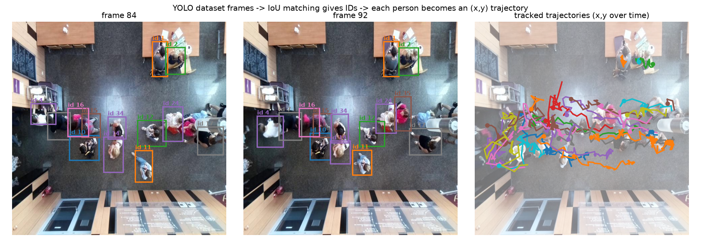
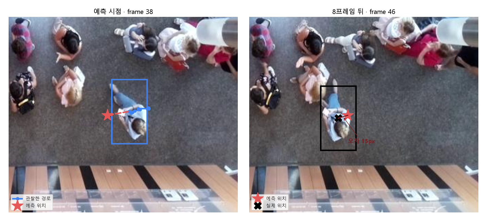

# cooking-robot-safety — 사람 궤적 예측 & 선제 정지

조리 로봇 셀을 천장 카메라로 감시해 사람이 다음에 어디로 갈지 예측하고, 위험하면 로봇을 미리 감속·정지시킨다. 이 레포는 궤적 예측과 안전 판정(SSM) 부분이다. 사람 검출 모델은 별도 레포에 있다: [overhead-person-yolo11](https://github.com/chanubc/overhead-person-yolo11)

## 왜 예측이 필요한가

로봇 주변에 원을 그려놓고 들어오면 정지하는 방식은 두 가지 문제가 있다. 이미 들어온 뒤에 멈추므로 늦고, 옆으로 지나갈 뿐인 사람에게도 멈춰서 생산성을 깎는다. 사람의 속도와 방향을 알면 "3초 뒤 위험구역에 들어온다"를 미리 판단할 수 있어, 선제 정지와 불필요한 정지 방지를 동시에 얻는다.

## 입력과 출력

```
천장 카메라 → YOLO 검출 → 추적(ID 부여) → [이 레포] 궤적 예측 → SSM 판정 → 로봇 제어
```

입력은 사람별 위치 시계열 `(시각, x, z)`, 출력은 미래 위치 `(시각, x, z, 불확실성)`과 최종 판정 `run / slow / stop`이다. 이미지가 아니라 좌표 숫자를 다룬다.

`python -m trajectory.example` — 사람이 로봇 쪽으로 접근하는 경우:

```
입력   (2.4, 2.4, 0) (2.6, 2.0, 0) (2.8, 1.6, 0) (3.0, 1.2, 0)   # x가 2.4에서 1.2로 접근
출력   t=3.4  x=+0.44  sigma=0.14    0.4초 뒤 위험구역 진입 예측
       t=5.0  x=-2.68  sigma=0.59    멀수록 불확실성 증가
판정   stop
```

## 궤적 데이터를 어디서 얻었나

검출용으로 쓴 [오버헤드 데이터셋](https://universe.roboflow.com/riccardo-kxtut/overhead-person-szky0/dataset/3)은 24개의 연속 영상을 프레임으로 자른 것이다. 프레임마다 있는 정답 박스를 겹침(IoU)으로 이어 붙이면 같은 사람에게 ID가 붙고, 그 사람의 (x, y) 이동 경로가 나온다. 검출용 데이터가 그대로 궤적 데이터가 된다.



왼쪽 두 장은 8프레임 차이이고 `id 2`, `id 11`, `id 16`이 유지된다. 오른쪽이 그렇게 만들어진 궤적이다. 이 방식으로 23개 클립에서 429개 궤적, 33,633개 평가 구간을 얻었다.

## 예측 예시 — 이동 전 / 이동 후

`cam_1` 영상의 `id 11`. 왼쪽이 예측 시점, 오른쪽이 8프레임 뒤 실제 장면이다.



| | frame 38 (예측 시점) | frame 46 (8프레임 뒤) |
|---|---|---|
| 사람 위치 | (448, 426) — 아직 오른쪽 | (402, 436) — 왼쪽으로 이동 |
| 관찰된 속도 | 프레임당 왼쪽 4px | |
| 예측 위치 | (416, 431) | 빨간 별로 표시된 그 자리 |
| 결과 | | 76px 이동, 오차 15px |

아무도 없는 자리에 빨간 별을 미리 찍어두고, 8프레임 뒤 사람이 실제로 그곳에 왔는지 확인한 것이다. 직진하면 이렇게 잘 맞지만 방향을 틀면 빗나간다(회전 구간 오차 65px). 이 약점이 학습형 모델을 검토한 이유다.

## 평가 방법

정답이 데이터 안에 있다. 궤적을 16프레임 창으로 자르고 앞 8프레임만 모델에게 보여준 뒤, 가려둔 뒤 8프레임을 얼마나 맞히는지 잰다.

- **ADE** (Average Displacement Error): 예측한 8개 시점 오차의 평균. 경로 전체 정확도.
- **FDE** (Final Displacement Error): 마지막 시점의 오차. 최종 도착지 정확도.

둘 다 거리 단위이고 낮을수록 좋다. 창 33,633개를 두 가지 방식으로 나눠 평가했다. 하나는 창을 무작위로 80/20 분할한 것(모델에 유리), 다른 하나는 영상 11개로 학습하고 한 번도 안 본 12개 영상으로 평가한 것(실제 배포에 가까움).

## 결과

`python -m trajectory.overhead_lstm` (천장뷰, 640px 환산)

| | ADE | FDE |
|---|---|---|
| **같은 영상으로 학습·평가** | | |
| 등속 | 8.3 | 13.8 |
| 칼만 | 8.6 | 14.2 |
| LSTM | 7.1 | 10.8 |
| **다른 영상으로 평가** | | |
| 등속 | 6.2 | 10.2 |
| 칼만 | 6.5 | 10.5 |
| LSTM | 6.8 | 10.6 |

공개 보행자 데이터(ETH)에서도 같은 패턴이 나온다(`python -m trajectory.eth_eval`). 같은 분포면 LSTM 우세(ADE 0.37 vs 칼만 0.46 m), 분포가 다르면 LSTM이 크게 무너진다(2.39 vs 0.55 m).

정리하면 세 가지다. LSTM은 배포 환경과 같은 분포의 데이터가 있을 때만 이득이고, 없으면 오히려 나빠진다. 천장뷰에서 사람은 느려서 오차가 프레임의 1~2% 수준이라 등속과 칼만만으로도 쓸 만하다. 따라서 칼만을 기본값으로 하고, 실제 조리실 궤적 데이터가 쌓이면 그때 학습형으로 올린다.

검출 노이즈가 섞이면 칼만이 등속보다 유리하다(합성 실험 ADE 0.23 vs 0.33 m). 위 표는 정답 박스를 써서 노이즈가 없었기 때문에 등속이 불리하지 않았다. 표의 평균은 거의 멈춰 있는 사람까지 포함한 값이며, 이동 중인 구간만 보면 FDE 중앙값은 27px이다.

## 지금 막혀 있는 곳: 검출

파이프라인이 검출에서 시작하므로 검출이 사람을 놓치면 궤적도 예측도 성립하지 않는다. 실제 조리 CCTV 한 편(61프레임, 프레임 단위 정답 라벨)으로 재보니 천장뷰로 파인튜닝한 모델이 stock YOLO보다 나빴다.

| conf 0.25 | 사람 검출률 | 사람 없는 프레임 오탐 |
|---|---|---|
| 천장뷰 파인튜닝 | 72.4% | 3장 중 3장 |
| stock yolo11s | 82.8% | 0장 |

학습 데이터는 천장 수직 시점인데 실제 CCTV는 비스듬한 각도라 화각이 다르다. 실제 화각의 조리실 영상으로 재학습해야 하며, 그 전까지 궤적 예측은 정답 박스나 시뮬 좌표로만 검증 가능하다. 자세한 근거는 [검출 레포](https://github.com/chanubc/overhead-person-yolo11) 참고.

## 설계

```
predict(TrackScene) → Prediction
   등속 · 칼만 · (미래) LSTM · Trajectron++
```

입력 규격은 처음부터 여러 사람, 여러 갈래 미래, 불확실성을 담게 만들었다. 그래서 예측기를 바꿔도 앞단(추적)과 뒷단(SSM 판정)은 수정할 필요가 없다. 브라우저에서 못 돌리는 무거운 모델이 필요해지면 엣지 PC로 옮기기만 하면 된다.

## 현황

구현 완료: 인터페이스 규격, 등속·칼만 예측기, ADE/FDE 평가, SSM 3단계 판정(테스트 9개 통과), 천장뷰·ETH 벤치마크.

남은 일: 실제 화각 검출 모델 재학습, 검출에서 추적까지 실제 파이프라인 연결, 안전지표(선제정지 성공률·오정지율) 실측, 브라우저 데모.

## 실행

```bash
uv pip install numpy matplotlib pytest torch opencv-python ultralytics
python -m pytest tests/ -q          # 테스트
python -m trajectory.example        # 입출력 예시
python -m trajectory.overhead_lstm  # 천장뷰 벤치마크
python -m trajectory.eth_eval       # ETH 벤치마크 (데이터 자동 다운로드)
```

`trajectory/types.py`가 표준 `types` 모듈과 이름이 겹치므로 `python -m` 으로 실행해야 한다.

설계 문서는 `docs/design.md`에 있다. 라이선스 MIT.
