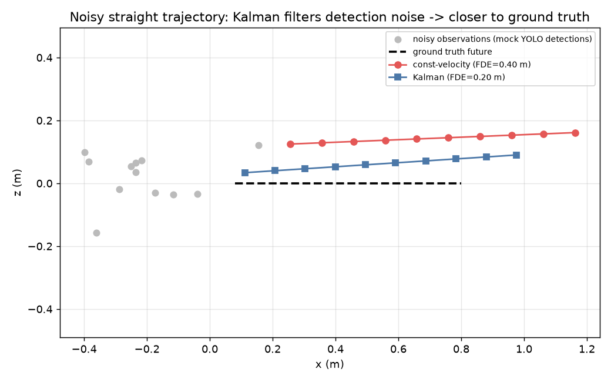
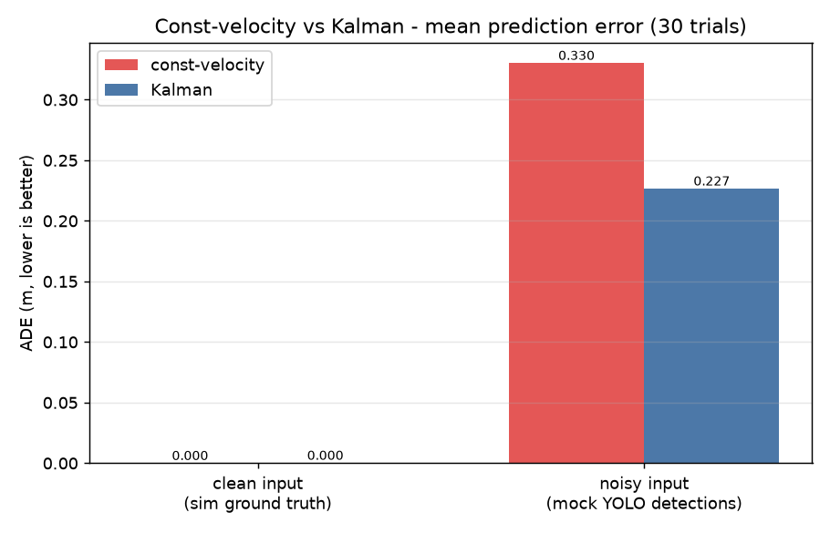
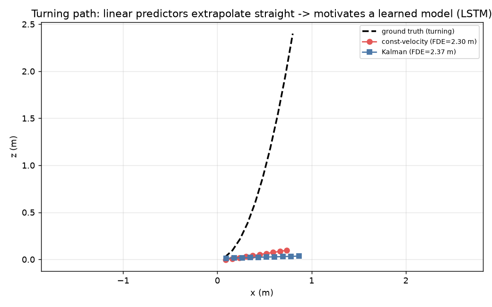

# cooking-robot-safety — 궤적 예측 & 선제 정지

급식 조리 로봇 셀을 **천장 카메라 한 대**로 감시해, 사람을 검출·추적·**궤적 예측**하고 위험 시 로봇을 **선제적으로 감속·정지**시키는 온디바이스 안전 시스템. 이 레포는 그중 **추적→궤적 예측→SSM 판정** 슬라이스를 담는다.

> 관련 컴포넌트 — 사람 검출 모델(YOLO11s)은 별도 레포: [chanubc/overhead-person-yolo11](https://github.com/chanubc/overhead-person-yolo11) · [🤗 모델](https://huggingface.co/chanubc/overhead-person-yolo11)

## 전체 파이프라인

```
[천장 카메라 이미지]
   → YOLO 검출        사람 박스 (픽셀)
   → 추적(ByteTrack)  사람별 ID + 궤적
   → 좌표 변환         바닥좌표 (미터)
   → 궤적 예측 ★       각 사람의 미래 위치 + 불확실성   ← 이 레포
   → SSM 판정 ★        run / slow / stop              ← 이 레포
   → 로봇 속도 제어
```

## 입력 / 출력 (실제 예시)

사람 1명이 로봇(원점)으로 -0.4 m/s로 다가오는 상황. 실행: `python -m trajectory.example`

**입력 `TrackScene`** — 각 사람의 최근 `(시각, x, z)` 좌표 시계열 + 예측 시간범위 + 로봇 위험영역:
```python
TrackScene(
    now=3.0, horizon=2.0,
    agents=[Track(id=1, history=[
        (2.4, 2.4, 0.0), (2.6, 2.0, 0.0), (2.8, 1.6, 0.0), (3.0, 1.2, 0.0),  # x가 2.4→1.2로 접근
    ])],
    map=Map(robot_zone={"x": 0.0, "z": 0.0, "r": 1.0}),
)
```

**출력 `Prediction`** (칼만) — 각 미래 시점의 `(시각, x, z, 불확실성 sigma)`:
```
t=3.4  x=+0.44  z=+0.00  sigma=0.14    # 0.4초 뒤 위험영역(r=1.0) 안으로 진입 예측
t=3.8  x=-0.34  z=+0.00  sigma=0.24
t=4.2  x=-1.12  z=+0.00  sigma=0.34
t=4.6  x=-1.90  z=+0.00  sigma=0.46    # 멀수록 sigma(불확실성) 증가
t=5.0  x=-2.68  z=+0.00  sigma=0.59
```

**SSM 판정** — 위험영역에 `t_stop`(1.2s) 이내 진입 예측이므로:
```
decision: "stop"   →  로봇 정지
```

즉 요약하면:
- **입력** = 각 사람의 `(시각, x, z)` 좌표 시계열 (이미지 아님, 숫자)
- **출력** = 각 사람의 미래 `(시각, x, z, 불확실성)` → 이어서 **`"run" / "slow" / "stop"`** 한 단어

## 데모 결과 (합성 궤적)

> ⚠️ 아래는 **합성 궤적** 시연이다. 조리실 실측이 아니며, 현재 시뮬 궤적이 빈약해 학습형 모델(LSTM)은 의도적으로 연기했다. 목적은 "칼만이 검출 노이즈를 얼마나 걸러내는가"의 검증.

### 칼만 vs 등속 — 노이즈 걸러내기
YOLO 검출은 프레임마다 조금씩 튄다(노이즈). 등속은 그 노이즈에 그대로 흔들리지만, 칼만 필터는 걸러내 정답 경로에 더 가깝게 예측한다.



### 평균 예측오차 (ADE, 30회 평균)
깨끗한 입력에선 둘 다 정확하지만, **노이즈 입력에서 칼만이 등속보다 약 31% 더 정확**하다.



| 입력 | const-velocity ADE | Kalman ADE |
|---|---|---|
| clean (sim 정답) | ~0.00 m | ~0.00 m |
| noisy (YOLO 모사) | **0.33 m** | **0.23 m** |

### 한계 — 꺾이는 궤적
등속·칼만 모두 "직선 외삽"이라 사람이 방향을 틀면 빗나간다. 이것이 나중에 **학습형 모델(LSTM)** 을 붙일 동기다 (현실적 궤적 데이터 확보가 전제).



## 예측 방법

| 방법 | 원리 | 학습 | 노이즈 강함 | 브라우저 이식 |
|---|---|---|---|---|
| 등속 | 최근 속도로 직선 외삽 | ✕ | ✕ | 매우 쉬움 |
| **칼만 필터** | 상태추정(위치·속도) + 측정 노이즈 보정 | ✕ | **✅** | 쉬움 |
| (연기) LSTM | 데이터로 비선형 동선 학습 | ✅ | 중간 | ONNX |
| (연기) Trajectron++ | 다인원 사회모델 | ✅ | — | ❌(온프레미스) |

**교체 가능 설계**: 예측기는 `predict(TrackScene) → Prediction` 인터페이스 뒤에 있어, 앞단(추적)·뒷단(SSM) 수정 없이 알맹이만 바꿀 수 있다. 인터페이스는 multi-agent·multimodal·불확실성을 처음부터 담아, 나중에 Trajectron++까지 무수정으로 꽂힌다.

## 현황

**✅ 된 것** (TDD, 테스트 전부 통과)
- 인터페이스 자료구조(`TrackScene`/`Prediction`)
- 등속 · 칼만 예측기
- 평가기(ADE/FDE)
- SSM 3단계 판정 (최악 케이스 TTC, 불확실성 보수적)

**⬜ 남은 것**
- 시뮬 ↔ 궤적모듈 연결 (① 정답 궤적 export)
- ③ YOLO+ByteTrack 실제 경로 (BEV 영상 → 검출 → 추적 → 좌표변환)
- 안전지표 실측(선제정지 성공률/오정지율) + 4칸 비교표
- 브라우저 라이브 데모 이식
- 학습형 모델(데이터 확보 후)

## 재현

패키지는 [uv](https://github.com/astral-sh/uv)로 관리.

```bash
uv pip install numpy matplotlib pytest
python -m pytest tests/ -q          # 테스트
python -m trajectory.benchmark      # 데모 그림 생성 (assets/)
```

> 참고: `trajectory/types.py`가 표준 `types`와 이름이 겹치므로, 스크립트는 반드시 **모듈 방식**(`python -m ...`)으로 실행한다.

## 설계 문서
`docs/design.md` — 아키텍처·인터페이스 계약·평가지표·에스컬레이션(온디바이스↔온프레미스)·구현 단계.

## 라이선스
MIT.
